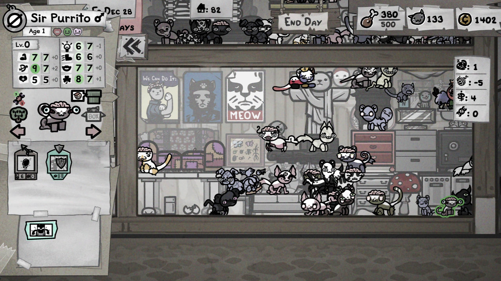

<!-- HERO -->

  
  <h1>🛡️ Costabo1</h1>
  
Penetration Testing • SOC Analysis • Malware Research

---

<!-- PORTFOLIO -->

<h2>📊 Portfolio</h2>

<h3>🧠 HackTheBox</h3>
<ul>
<li><a href="facts/index123.md">Facts (Linux + PrivEsc)</a></li>
<li><a href="Silentium.md">Silentium (RCE chain)</a></li>
</ul>

<h3>🔍 LetsDefend</h3>
<ul>
<li>Network Log Analysis</li>
<li>Dynamic Malware Analysis</li>
</ul>

---

<!-- ABOUT -->

<h2>🔎 About Me</h2>

Security enthusiast focused on real-world attack simulation and defensive analysis.

Web Exploitation
Active Directory
Cloud Security
Malware Analysis
SIEM

